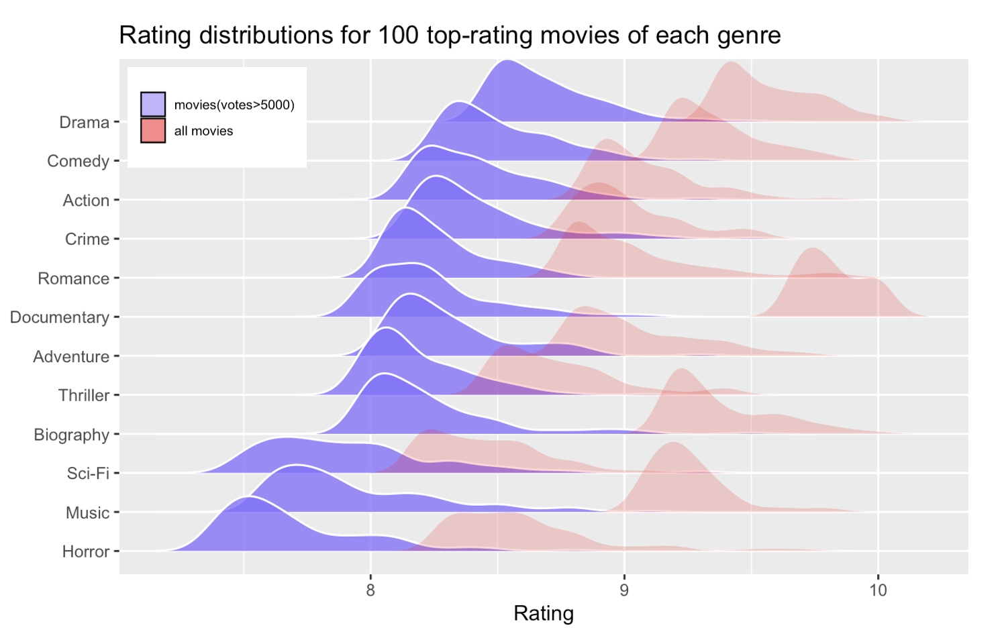
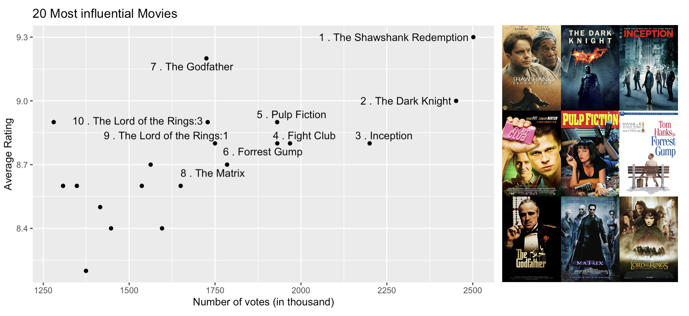
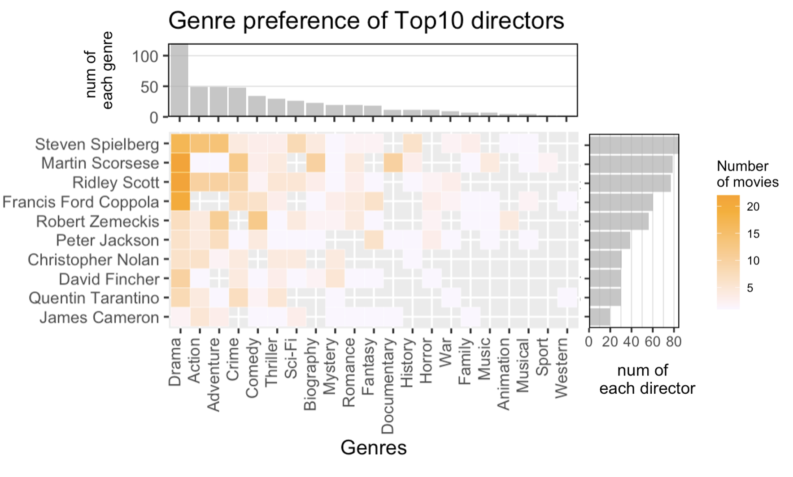

# Results


## Movie ratings

```{r, echo=FALSE}
library(tidyverse)
library(readr)
library(grid)
library(gridExtra)
library(ggridges)
library(treemap)
library(GGally)
library(Lock5withR)
library(vcd)
library("patchwork")
source("scripts/visna.R")
source("scripts/subN.R")
```

```{r, echo=FALSE}
load('data/title.basics.RData')
load('data/name.basics.RData')
load('data/title.crew.RData')
#load('../data/title.principals.RData')
load('data/title.ratings.RData')
load('data/title.genres.RData')
```


### Ratings for all movies
IMDB rating is a good reference if we want to know the quality of different movies. Do different genres have obviously different average ratings? Has the quality of movies changed over time? We can find something from the figure below:

```{r, echo=FALSE}
main_genres <- c( 'Drama','Comedy','Music','Documentary','Action', 'Romance', "Thriller",'Crime', 'Horror', 'Adventure', 'Biography', 'Sci-Fi')

x <- left_join(title.genres, title.basics, by='tconst')
x <- left_join(x, title.ratings, by='tconst')

df <- x %>% 
  filter(startYear<=2020,startYear>=1980, genres.x %in% main_genres, is.na(numVotes)==FALSE, is.na(averageRating)==FALSE) %>%
  mutate(totalratings=numVotes*averageRating) %>%
  group_by(startYear, genres.x) %>%
  summarise(rating2=sum(totalratings)/sum(numVotes), .groups = 'drop') %>%
  ungroup() 


xlabels = c(1980:2020)
for (i in 1:length(xlabels)){
  if (strtoi(xlabels[i])%%5!=0){
    xlabels[i] <- ""
  }
}

g2 <-ggplot(df, aes(startYear, fct_rev(factor(genres.x)), fill = rating2)) +
  geom_tile(color = "white") +
  coord_equal() +
  scale_fill_gradient(low="white", high="blue", guide = guide_colourbar(title='Weighted \n Rating')) +
  scale_x_discrete(labels=xlabels) +
  xlab("") +
  ylab("")


main_genres <- c( 'Drama','Comedy','Music','Documentary','Action', 'Romance', "Thriller",'Crime', 'Horror', 'Adventure', 'Biography', 'Sci-Fi')


df <- x %>% 
  filter(startYear<=2020,startYear>=1980, genres.x %in% main_genres, is.na(numVotes)==FALSE, is.na(averageRating)==FALSE) %>%
  group_by(startYear, genres.x) %>%
  summarise(rating=mean(averageRating), .groups = 'drop') %>%
  ungroup() 


g1 <- ggplot(df, aes(startYear, fct_rev(factor(genres.x)), fill = rating)) +
  geom_tile(color = "white") +
  coord_equal() +
  scale_fill_gradient(low="white", high="blue", guide = guide_colourbar(title='Avg Rating')) +
  scale_x_discrete(labels=xlabels) +
  xlab("") +
  ylab("")


g1 / g2  +    # Create grid of plots with title
  plot_annotation(title = "Ratings of different genres", caption="Year",
                  theme = theme(plot.title = element_text(size = 15), plot.caption =element_text(size=12,hjust = 0.5,vjust=6) ))

```

This is an interesting plot about the ratings of different genres changing with time. The top one calculates the average ratings of movies from each genre and each year. It seems that `Documentary`, `Biograph` and `Music` have the highest ratings, while ratings for `Horror` movies are the lowest. And there is no obvious trend along the `Year` dimension.  

However, let's consider this situation: there are two `Action` movies in 2050.One gets 10000 votes of 10 star, one gets gets 1 vote of 0 star. The average rating would be 5 star. This seems a little unfair, right?  

So we also use `weighted average`, where weights are their number of votes, and we get the bottom plot. Surprisingly, the ratings between different genres are not so large as we thought.  `Documentary` and `Biography` are not much higher than the others, although `Horror` still seems the lowest. 

Another interesting discovery is that there is a trend along time: movies before 2000 clearly have higher weighted ratings than movies after 2000. Maybe this is a reflection that the quality of movies in recent years are not as well as before?


### Rating distributions for highly rated movies
Now that we have a view of ratings of all movies, what about those top-rating movies? Do people have preference among different genres when they are rating? We select 100 top-rating movies of different genres and plot their distributions:

```{r, echo=FALSE, eval=FALSE}
main_genres <- c( 'Drama','Comedy','Music','Documentary','Action', 'Romance', "Thriller",'Crime', 'Horror', 'Adventure', 'Biography', 'Sci-Fi')

x <- left_join(title.genres, title.ratings, by='tconst')

x1 <- x %>%
  filter(genres %in% main_genres, numVotes>5000) %>%
  group_by(genres) %>%
  mutate(r=rank(averageRating*(-1))) %>%
  ungroup() %>%
  filter(r<=100)

x2 <- left_join(x1, title.basics, by='tconst')

x2$genres.x <- with(x2 ,reorder(genres.x,averageRating,median))


x <- left_join(title.genres, title.ratings, by='tconst')

x1 <- x %>%
  filter(genres %in% main_genres) %>%
  group_by(genres) %>%
  mutate(r=rank(averageRating*(-1))) %>%
  ungroup() %>%
  filter(r<=100)

x22 <- left_join(x1, title.basics, by='tconst')

#x2$genres.x <- with(x2 ,reorder(genres.x,averageRating,median))

library(ggridges)
g <- ggplot() +
  geom_density_ridges(data = x2, aes(y = genres.x, x = averageRating), alpha=0.8,color='white', fill='lightslateblue')+
  geom_density_ridges(data = x22, aes(y = genres.x, x = averageRating), alpha=0.2,color=rgb(0,0,0, alpha=0, maxColorValue = 1),
                      fill='red') +
  ylab("")+xlab("Rating")+
  ggtitle('Rating distributions for 100 top-rating movies of each genre')
g

```

```{r echo=FALSE, fig.cap="", out.width = '80%',fig.align='center'}

```  

If we select movies from all of them, we get the red distributions. But if we only consider movies with more than 5000 votes, we get the purple ones. We find that `Documentary` has the highest median if we consider all movies, but it gets lower if we exclude those without enough votes. It turns out that there are many documentary movies only have 20 or 50 votes with almost 10 star ratings. It's the same with biography and music movies. 

If we exclude these not well-known works, we can get a picture of the preferences of the most population. It shows that people tend to give higher ratings for `Romance` movies, while it's very hard for `Horror` movies to get high scores. 


### Number of votes
As we can see, those movies with few votes can cause big difference when we are analysing the data. What are these movies like? We select those movies with less than 5,000 votes on IMDB and see where they come from: 

```{r, echo=FALSE}
x <- left_join(title.genres, title.ratings, by='tconst')

x1 <- x %>%
  filter(numVotes<5000)

x2 <- left_join(x1, title.basics, by='tconst')

x3 <- x2 %>%
  group_by(genres.x) %>%
  summarise(c=n()) %>%
  ungroup()
    
library(treemap)
treemap(x3, index="genres.x", vSize="c", type="index",
        title='Movies (votes<5000)',fontsize.title=12)
```

These movies mostly come from `Drama`, `Comedy`, `Documentary`, which is not very surprising. However, we can sense that they may have different ratings, because when we exclude these movies, the average ratings of different genres change differently. 

So now we plot the ratings of these movies and get this:

```{r, fig.width=8,fig.height=6, echo=FALSE}
x <- left_join(title.genres, title.ratings, by='tconst')
main_genres = c('Documentary', 'Horror', 'Action', 'Drama')
x1 <- x %>%
  filter(numVotes<5000,numVotes>0, genres %in% main_genres)


cl <- function(r){
  if (r>=0 & r<4) return('0-4')
  if (r>=4 & r<6) return('4-6')
  if (r>=6 & r<8) return('6-8')
  if (r>=8 & r<=10) return('8-10')
}

x1$rating1 <- lapply(x1$averageRating, cl)
x1$rating2 <- unlist(x1$rating1)
x1$Rating <- fct_rev(factor(x1$rating2))
x1$genres <- factor(x1$genres)
#levels(x1$genres) <- c('Documentary', 'Drama','Crime','Action','Horror')
x1$Genre <- fct_rev(fct_relevel(x1$genres,'Documentary', 'Drama','Action','Horror'))

library(Lock5withR)
library(vcd)
mosaic(Rating~Genre, direction = c("v","h"),x1,main='Ratings of movies (votes<5000)')
```

As we can see, among these movies, `Documentary` mostly have 6-10 stars, while `Horror` movies mostly have 0-6 stars. This proves what we think: there exists many documentary movies with small number of votes but very high ratings. 


### Dependency between votes, ratings and runtime
Now we may wonder if votes and ratings have some relationship. The graph below shows the relationship among three variables: votes, ratings, and runtime. Note that we only select popular movies (with number of votes larger than 200,000) to exclude those 'noisy' less popular movies.

```{r, echo=FALSE}
main_genres <- c( 'Drama','Comedy','Music','Documentary','Action','Sci-Fi')
x <- left_join(title.basics, title.ratings, by='tconst')
x$runtimeMinutes <- as.integer(x$runtimeMinutes)
x$numVotes <- x$numVotes/1e3

x1 <- x%>%
  filter(genres %in% main_genres,is.na(runtimeMinutes)==FALSE, is.na(averageRating)==FALSE, is.na(numVotes)==FALSE, runtimeMinutes<400,startYear>=1940,startYear<=2020, numVotes>200)
x1$votes_in_thousand <- x1$numVotes
  
x2 <- x1 %>%select(runtimeMinutes, averageRating, votes_in_thousand)
library(GGally)
ggpairs(x2, aes(alpha=0.5),title="Relationships between runtime, rating and num of votes")

```

The average rating and number of votes have obvious relationship. This is not difficult to understand: better movies are usually more popular so more people would vote. We also find that longer movies tend to have higher ratings. This is an interesting discovery. One reason could be that longer movies usually come from those with meaningful topics, while entertainment movies are usually shorter. 


### Movies with most stars
We have learned that average ratings and number of votes both reflect a movie's quality. Now let's combine these two metrics together to find the best movies on IMDB. If we consider 10 score as 10 stars, we want to find the movies with most stars in history. We can consider them the most influential movies.

```{r, echo=FALSE,eval=FALSE}
library(ggrepel)
x1 = left_join(title.basics, title.ratings, by='tconst')
x2 = left_join(x1, title.crew, by='tconst')
x2$nconst = x2$directors
x3 = left_join(x2, name.basics, by='nconst') %>%
  mutate(totalstar=numVotes*averageRating, r=rank(-totalstar)) %>%
  filter(r<=20)
x3$numVotes = x3$numVotes/1000

changename <- function(x) {
  if (x=="The Lord of the Rings: The Fellowship of the Ring") return("The Lord of the Rings:1")
  if (x=="The Lord of the Rings: The Return of the King") return("The Lord of the Rings:3")
  return(x)
}
x3$title <- lapply(x3$primaryTitle, changename)

x3$title2 = "1"
for (i in 1:nrow(x3)){
  x3[i,"title2"] = paste(x3[i,"r"], '.',unlist(x3[i,"title"]))
}

x3%>%mutate(title2=paste(r,title))%>%
  ggplot(aes(x=numVotes, y=averageRating))+
  geom_point()+
  geom_text_repel(data=filter(x3, r<=10),aes(label = title2))+
  xlab("Number of votes (in thousand)")+ylab("Average Rating")+ggtitle("20 Most influential Movies")
  #geom_text(data=filter(x3, r<10),aes(label=primaryTitle),vjust=1.1,position=position_jitter(width=1))
```

```{r echo=FALSE, fig.cap="", out.width = '100%',fig.align='center'}

```  

The plot shows the rating and number of votes of the 20 movies with most stars on IMDB. You must have heard most of them, if you haven't watched all of them. Top 1 is the famous `The Shawshank Redemption`, which is not very surprising. All the movies in top 20 are released after 1990, except `The Godfather` (1972). 

The second one and the third one are both directed by Christopher Nolan, one of the most popular directors nowadays. There are totally 5 of the top 20 movies directed by Nolan! Two of three `The Lord of the Rings`, directed by Peter Jackson, get into top 10. Other famous directors, including Quentin Tarantino, Steven Spielberg and David Fincher, also have more than one movies in top 20.


## Most popular directors
### Top10 directors with most stars
Let's use the same way to find the most popular directors! Here we find the top 10 directors and their rating distributions: 

```{r, echo=FALSE}
library(ggrepel)
x1 = left_join(title.basics, title.ratings, by='tconst')
x2 = left_join(x1, title.crew, by='tconst')
x2$nconst = x2$directors
x3 = left_join(x2, name.basics, by='nconst') %>%
  filter(is.na(primaryName)==FALSE)%>%
  mutate(totalstar=numVotes*averageRating) %>%
  filter(is.na(totalstar)==FALSE)%>%
  group_by(primaryName) %>%
  summarise(stars=sum(totalstar))%>%
  arrange(desc(stars))

directors10 = x3[1:10,]$primaryName

x4<- left_join(x2, name.basics, by='nconst')%>% filter(primaryName %in% directors10, is.na(averageRating)==FALSE)

x4$primaryName <- with(x4 ,reorder(primaryName,averageRating,median))
ggplot(x4,aes(x=primaryName,y=averageRating)) + geom_boxplot(varwidth = TRUE)+
  coord_flip() + 
  ylab('Ratings') + xlab('') +
  ggtitle('Rating distributions of Top 10 directors')
```

I am sure you have heard most of them. Note than the width of boxes reflects the number of movies directed by that director. As we can see, Nolan has the highest median ratings, although his number of movies are not a lot. Steve Spielberg directed most movies among them, while James Cameron directed the least number. We can also notice that the directors with more movies have lower average ratings, which is understandable since it's hard to make all of your works liked by most of the people.


### Genre preference of top10 directors
Which genres are prefered by these famous directors? We can find them in this plot:

```{r, echo=FALSE,eval=FALSE}
x <- left_join(x4, title.genres, by='tconst') %>%
  group_by(genres.y, primaryName) %>%
  summarise(c=n(),.groups='drop')
x$genre = as.factor(x$genres.y)


genre_freq <- x %>%
  group_by(genre) %>%
  summarise(f=sum(c)) %>%
  ungroup() %>%
  arrange(desc(f))

director_freq <- x %>%
  group_by(primaryName) %>%
  summarise(f=sum(c)) %>%
  ungroup() %>%
  arrange(desc(f))


main <- ggplot(x, aes( factor(genre,levels=genre_freq$genre),fct_rev(factor(primaryName, levels=director_freq$primaryName)), fill = c)) +
  geom_tile(color = "white") +
  coord_equal() +
  scale_fill_gradient(low=rgb(250/255,246/255,255/255), high="orange", guide = guide_colourbar(title='Number \nof movies')) +
  xlab("Genres") +
  ylab("") +ggtitle('')+theme(legend.position = "none")+
  theme (axis.text.x = element_text (angle = 90, vjust =0, hjust=1)) 


up <- ggplot(genre_freq, aes(x=factor(genre, levels=genre_freq$genre), y=f)) +
  geom_bar(stat="identity", fill="orange", alpha=0.7) +
  xlab("") +scale_x_discrete(labels=NULL)+
  ylab("num of \n each genre") +
  ggtitle("Genre preference of Top10 directors") +
  scale_y_continuous(expand = c(0, 0),breaks=function(x) pretty(x, n=4)) +
  theme(panel.border = element_rect(fill=NA, size=0.6),
        panel.background = element_blank(),
        panel.grid.major.y = element_line(color="#E0E0E0", size=0.3),
        panel.grid.minor.y = element_blank(),
        panel.grid.minor.x = element_blank(),
        panel.grid.major.x = element_blank())


right <- ggplot(director_freq, aes(x=fct_rev(factor(primaryName, levels=director_freq$primaryName)), y=f)) +
  geom_bar(fill="orange", stat="identity", alpha=0.7) +
  coord_flip() +
  scale_y_continuous(expand = c(0, 0),breaks=function(x) pretty(x, n=4)) +
  xlab("") +
  ylab("num of \n each director") +
  theme(panel.border = element_rect(fill=NA, size=0.6),
        panel.background = element_blank(),
        panel.grid.major.x = element_line(color="#E0E0E0", size=0.3),
        panel.grid.minor.x = element_line(color="#E0E0E0", size=0.3),
        panel.grid.minor.y = element_blank(),
        panel.grid.major.y = element_blank(),
        legend.position = "none")


library(patchwork)
up +  plot_spacer() + main + right + plot_layout(nrow=2,ncol=2, widths=c(4,1),heights=c(2,6))
```

```{r echo=FALSE, fig.cap="", out.width = '80%',fig.align='center'}

```  

The top10 directors made 227 movies in total! It shows that `Drama`, `Action` and `Adventure` are the most. Martin Scorsese seems like `Biography` and `Documentary` compared with the others. Robert Zemeckis make the most number of `Comedy`, although his most famous work is Forrest Gump. `Crime` seems to be Quentin's favorite.


## Movie titles
### Most common words in titles
Do movies of different genres prefer different words in titles? For example, maybe there are a lot of `heart` in `Romance` movies titles? Here we select 15 most common words from `Action`, `Animation`, `Romance`, `Sci_Fi` (meaningless words like 'the', 'to' are excluded):

```{r, echo=FALSE}
main_genres <- c( 'Drama','Comedy','Music','Documentary','Action', 'Romance', "Thriller",'Crime', 'Horror', 'Adventure', 'Biography', 'Sci-Fi')

x <- left_join(title.genres, title.basics, by='tconst')

x1 <- x %>%
  filter(startYear>=1990, startYear<=2020)


WordFreq <- function(text) {
  txt = text[text!=""]
  txt = tolower(txt)
  txtList = lapply(txt, strsplit," ")
  txtChar = unlist(txtList)
  txtChar = gsub("\\.|,|\\!|:|;|\\?","",txtChar) #clean symbol(.,!:;?)
  txtChar = txtChar[txtChar!=""]
  data = as.data.frame(table(txtChar))
  colnames(data) = c("Word","freq")
  ordFreq = data[order(data$freq,decreasing=T),]
  meaningless = c('the','of','a','and','2','3','in','movie','an','last','i','you','my','me','man','en','del','le','un','der','les','to','one','no','not','it','from','-','de','la','el','&','for','on','is','with','at','ka','ii','ang','up','ng','na','your')
  ordFreq <- ordFreq %>% filter(!(Word %in% meaningless))
  return(ordFreq)
}

text = x1 %>% filter(genres.x=='Romance') %>%
  select(primaryTitle)
ordFreq1 <- WordFreq(text)
ordFreq1$genre <- 'Romance' 
text = x1 %>% filter(genres.x=='Action') %>%
  select(primaryTitle)
ordFreq2 <- WordFreq(text)
ordFreq2$genre <- 'Action'
text = x1 %>% filter(genres.x=='Animation') %>%
  select(primaryTitle)
ordFreq3 <- WordFreq(text)
ordFreq3$genre <- ''
text = x1 %>% filter(genres.x=='Sci-Fi') %>%
  select(primaryTitle)
ordFreq4 <- WordFreq(text)
ordFreq4$genre <- 'Sci-Fi'

ordFreq <- rbind(ordFreq1[1:15,], ordFreq2[1:15,])


g1 <- ggplot(ordFreq1[1:15,], aes(x=freq, y=fct_reorder(Word, freq))) +
  geom_segment( aes(x=0, xend=freq, y=fct_reorder(Word, freq), yend=fct_reorder(Word, freq)), color="skyblue") +
  geom_point( color="blue", size=1, alpha=0.6) +
  ggtitle("Guess 1") +
  theme_light() +
  ylab("") +  xlab("") +
  theme(
    panel.grid.major.y = element_blank(),
    panel.border = element_blank(),
    axis.ticks.y = element_blank()
  )

g2 <- ggplot(ordFreq2[1:15,], aes(x=freq, y=fct_reorder(Word, freq))) +
  geom_segment( aes(x=0, xend=freq, y=fct_reorder(Word, freq), yend=fct_reorder(Word, freq)), color="skyblue") +
  geom_point( color="blue", size=1, alpha=0.6) +
  ggtitle("Guess 2") +
  theme_light() +
  scale_x_continuous(breaks = c(0,100,200,300,400), labels=c(0,"",200,"",400))+
  ylab("") +
  xlab("") +
  theme(
    panel.grid.major.y = element_blank(),
    panel.border = element_blank(),
    axis.ticks.y = element_blank()
  )

g3 <- ggplot(ordFreq3[1:15,], aes(x=freq, y=fct_reorder(Word, freq))) +
  geom_segment( aes(x=0, xend=freq, y=fct_reorder(Word, freq), yend=fct_reorder(Word, freq)), color="skyblue") +
  geom_point( color="blue", size=1, alpha=0.6) +
  ggtitle("Guess 4") +
  theme_light() +
  ylab("") +
  xlab("") +
  theme(
    panel.grid.major.y = element_blank(),
    panel.border = element_blank(),
    axis.ticks.y = element_blank()
  )

g4 <- ggplot(ordFreq4[1:15,], aes(x=freq, y=fct_reorder(Word, freq))) +
  geom_segment( aes(x=0, xend=freq, y=fct_reorder(Word, freq), yend=fct_reorder(Word, freq)), color="skyblue") +
  geom_point( color="blue", size=1, alpha=0.6) +
  ggtitle("Guess 3") +
  theme_light() +
  xlab("") +
  ylab("") +
  theme(
    panel.grid.major.y = element_blank(),
    panel.border = element_blank(),
    axis.ticks.y = element_blank()
  )


ggp_all <- (g1 |g2 | g4 | g3) +    # Create grid of plots with title
  plot_annotation(title = "Most common words in different genres' titles", caption="Frequence",
                  theme = theme(plot.title = element_text(size = 15), plot.caption =element_text(size=12,hjust = 0.5,vjust=6) ))
ggp_all 
```

The genre of each plot is hidden. Can you match these four plots with the four genres?  

It should be easy. The first one, with 'love' having highest frequency, is `Romance`. We can also see 'girl', 'heart', 'wedding' in these titles. The second one have 'vs', 'blood', 'hero', so it is obviously `Action`. What about 'alien', 'space', 'star'? `Sci_Fi` movies love these topics! And lastly, for little children, 'little', 'magic', 'christmas'. It must be `Animation`. Do you get them all right?  

Also we can notice that 'love' is one of the most common words for many genres. Maybe love is the eternal theme for human! 


### Length of Titles
What's the average length of movie titles and does it change with time? We plot the average length of titles:

```{r}
main_genres <- c('Comedy','Music','Documentary','Action','Sci-Fi')
x <- left_join(title.genres, title.basics, by='tconst')

x1 <- x %>%
  filter(genres.x %in% main_genres) %>%
  mutate(decade=strtoi(startYear)-strtoi(startYear)%%4)

x1$len_title = lapply(x1$primaryTitle, function(t){return(length(strsplit(t," ")[[1]]))})
x1$len_title = as.integer(x1$len_title)
x1$genres.x <- with(x1 ,reorder(genres.x,len_title,median))


xlabels = c(1920:2020)
for (i in 1:length(xlabels)){
  if (strtoi(xlabels[i])%%10!=0){
    xlabels[i] <- ""
  }
}


x2 <- x1 %>%   filter(genres.x %in% main_genres, decade>=1940, decade<=2020) %>%
  group_by(genres.x, decade) %>%
  summarise(len=mean(len_title),low=len-sd(len_title)/30,high=len+sd(len_title)/30 ,.groups='drop') 
x2$genres.x <- fct_relevel(x2$genres.x, 'Music', 'Documentary', 'Comedy', 'Action', 'Sci-Fi')

x2 %>% ggplot(aes(x=decade, y=len, color=genres.x))+
  geom_line()+
  ggtitle('Average length of movie titles')+
  ylab('Length') +xlab('')+
  guides(color=guide_legend(title="Genre"))

```

We can see that at first they don't have much difference, but as time develops `Music` and `Documentary` have longer titles with average length of 4, and `Comedy`, `Action`, `Sci-Fi` have shorter average titles. It can also be noticed that their average title length was decreasing from 1970 to 2000, but after 2000 their length has been increasing. 


